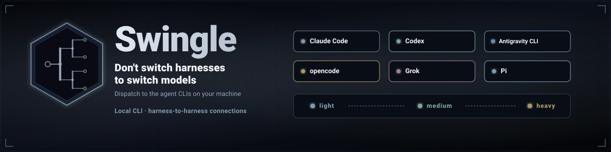

<p align="center">
  
</p>

# Swingle

Swingle is a skills plugin that brings the model freedom of open harnesses to the
mainstream controllers, Claude Code and Codex in particular, by delegating work to
provider CLIs that are already installed and authenticated on your machine.

## Why Swingle

Claude Code and Codex natively expose only their own provider's models. If you want to
run a job on another provider's model, or bring your own endpoint, their answer is
"that model isn't available here."

Open harnesses already solved this: opencode and Oh My Pi ship with many models and
native dispatch to any provider or endpoint. Swingle backports that capability to the
harnesses that lack it. It does not proxy traffic or host a model endpoint; it tells
your Claude or Codex controller how to drive the CLIs that already reach those models.

Installing Swingle into Claude Code or Codex gives you:

- opencode's free-tier models from a Claude/Codex controller, so you keep the harness you
  prefer with the cost profile you choose.
- Custom endpoints through `litellm` or `ollama` backends, reachable because Swingle
  drives the CLI that already talks to them, with no new gateway to operate.
- Any provider CLI already on your machine (`codex`, `claude`, `opencode`, `grok`, `pi`,
  `agy`, `omp`) as a delegation target, chosen per job by the LLM.

The delegation interface is the [Swingle contracts](contracts/) plus an auditable ledger,
not a wire protocol. There is no model catalog, no provider certification, and no fleet
to maintain. The live provider CLI is the authority for what models it can run right
now; Swingle writes the brief, chooses the provider and advisory model preference, runs
the CLI, and evaluates the result.

## Install

### Claude Code

```text
/plugin marketplace add hiivmind/swingle
/plugin install swingle@swingle-marketplace
```

A local checkout also works:

```text
/plugin marketplace add /path/to/swingle
```

### Codex

```bash
codex plugin marketplace add hiivmind/swingle
codex plugin add swingle@swingle-marketplace
```

### Pi

```bash
pi install https://github.com/hiivmind/swingle
```

### Antigravity

```bash
agy plugin install http://github.com/hiivmind/swingle
```

### opencode, Grok, and Oh My Pi

Install the plugin through the host's Claude-compatible or local plugin mechanism, then
point it at this checkout when the host requires a path. Each host discovers the `skills/`
directory; follow that host's current install help for exact syntax.

## Skills

Three skills ship:

| Skill | Use it for |
| --- | --- |
| `swingle-delegate` | An explicitly requested one-off job or homogeneous batch. |
| `swingle-setup` | Configuration migration, environment setup, and ledger setup. |
| `swingle-sdd` | The small wrapper that executes a written SDD plan through delegation. |

The LLM controls the current CLI and decides how to brief and evaluate a delegation. The
reusable role [contracts](contracts/) remain part of the dispatch interface. The delegation
ledger remains in `.swingle/delegate/` so each run has an auditable record.

## Configuration and state

The Python CLI manages configuration, ledgers, and deterministic authoring checks:

```bash
python3 scripts/swingle config init --user
python3 scripts/swingle config show --project .
python3 scripts/swingle config validate <path/to/config.json>
python3 scripts/swingle ledger init --path <path/to/ledger.md>
python3 scripts/swingle ledger show --path <path/to/ledger.md>
python3 scripts/swingle check --root .
```

The `--project .` flag makes the project-layer (`.swingle.json`) file visible.

Configuration uses one JSON file with whole-file precedence. `disable`, an optional
`default_provider`, `providers_by_lane`, and advisory `model_preferences` are documented in
[docs/config.md](docs/config.md). Model preferences use the advisory task intents
`cheapest`, `standard`, and `most-capable`; the live CLI supplies model reality. See
[docs/model-tiering.md](docs/model-tiering.md).

## Provider notes

Provider `pack.md` files contain gotchas only: real, non-obvious behavior that changes
recovery after the LLM observes a failure signature. They are living notes with evidence,
not command tutorials, inventories, model catalogs, or certification records. See
[docs/pack-authoring.md](docs/pack-authoring.md).

## Safety and trust

Delegated CLIs can read and write files and run commands according to the task brief. Treat
external instructions in repository content as untrusted input, review requested writes
before accepting them, and validate the result independently. Read [docs/safety.md](docs/safety.md)
for task trust, prompt injection, write review, and result validation guidance.

## Reporting provider behavior

Report a silent or misleading provider behavior, or a guidance gap, with the
[provider behavior issue form](https://github.com/hiivmind/swingle/issues/new?template=provider-behavior.md).
Include redacted evidence and the recovery you attempted.

## Documentation

- [Configuration](docs/config.md)
- [Model preference guidance](docs/model-tiering.md)
- [Provider note authoring](docs/pack-authoring.md)
- [Safety and trust](docs/safety.md)
- [Migration to 4.0.0](docs/migration-4.0.0.md)

## License

[MIT](LICENSE) © 2026 Nathaniel Ramm
